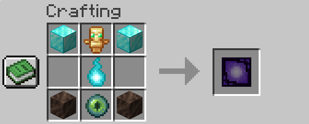
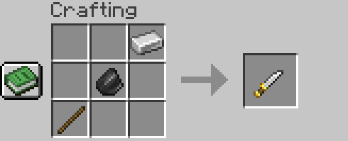
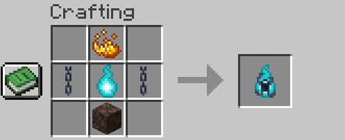
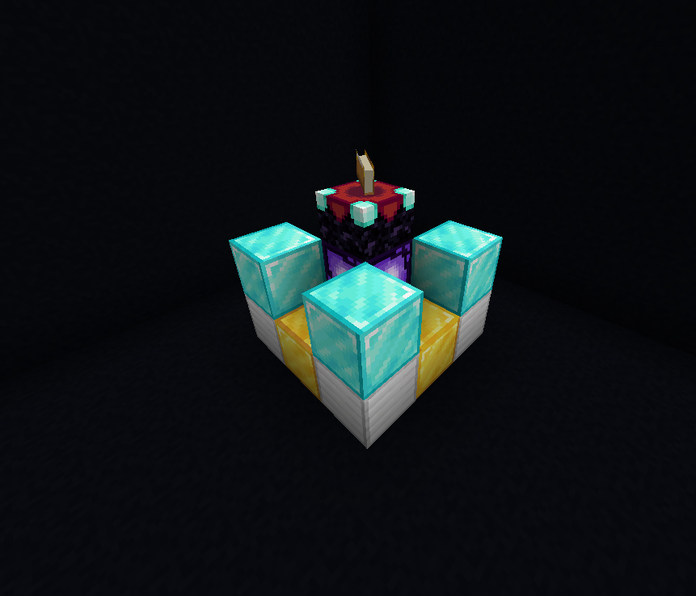

# SemiHardcore [Minecraft 1.20.4]

SemiHardcore is a multiplayer Forge mod for Minecraft 1.20.4 that aims to maintain the challenge of Hardcore mode in
Minecraft without losing the world on the first death.

## Disclaimer 
The mod is in development and may not work flawlessly. Features may undergo significant changes in the future.

## Gameplay

Each player starts with three lives. Upon each death, a player drops a Soul Item. A player needs at least one Soul Item
to craft the Revive Beacon. Upon crafting the Revive Beacon, the player becomes bound to that Beacon and can only use it
for revival.
To use the Revive Beacon, it must be placed in the world, surrounded by specific blocks (similar to the Nether Reactor
from older PE versions of Minecraft). A living player needs the Knife Item and must use it with a right-click. Only then
the player can apply it to the Revive Beacon to resurrect their teammate. The placed blocks are lost in this process.

*But be cautious, the Revive Beacon is very fragile. It can be easily destroyed by explosions, and not all items will be
dropped upon removal, even while using Silck Touch!*

## Crafting and multiblock structure

#### Revive Beacon

  

#### Knife

  

#### Soul Chain

  

#### Revive Beacon structure

  

## License

The mod is free software and released under the GPLv3. Notice that Forge and other dependencies have their own licenses.
